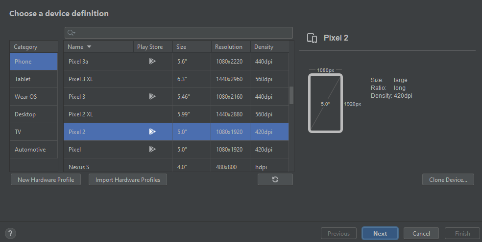

# About the project
Smart Home NILM is a mobile application development project that utilises the FIBARO API to provide homeowners with convenient access to the smart devices in their homes. Created using flutter to be used on cross platforms(Android and iOS), our primary feature is the ability to monitor household electrical consumption, offering insights into the usage patterns of individual devices. By integrating a specialised device into the circuit breaker, our application can analyse and identify the energy consumption of each device. This information allows us to calculate both the overall household cost and the running expenses associated with specific appliances. Armed with this data, homeowners can adjust their electrical usage habits and optimise their resource utilisation.
---

## Table of Contents
- [About the project](#about-the-project)
- [Table of Contents](#table-of-contents)
- [Installation Instructions](#installation)
  - [Prerequisites](#prerequisites)
  - [Environment requirements](#environment-requirements)
  - [Flutter Installation](#flutter-installation)
  - [Visual Studio Code Installation (Not for macOS)](#visual-studio-code-installation-not-for-macos)
  - [Android Studio and Emulator Setup](#android-studio-and-emulator-setup)
  - [iOS xCode simulator setup](#ios-xcode-simulator-setup)
  - [Running Smart Home NILM](#running-smart-home-nilm)
- [Usage](#usage)
  - [Features](#features)
  - [API Routes](#api-routes)
  - [Libraries](#libraries)
  - [Code Organisation](#code-organisation)
  - [Code Standarisation](#code-standardisation)
- [License](#license)
- [Acknowledgements](#acknowledgements)
- [Troubleshooting](#troubleshooting)
  - [Common Issues](#common-issues-that-arise)
  - [Additional Resources](#additional-resources)
- [Contact Information](#contact-information)
- [Version History](#version-history)

## Installation Instructions

### Prerequisites
Ensure you have the following requirements before proceeding:  
- Wifi connection.
- A system running Windows or macOS
- Sufficient hardware specs (at least 8GB RAM and 10GB of free disk space).

### Environment requirements
Below are the requirements needed for building and running the mobile application
- Visual Studio Code
- Flutter SDK
- Visual Studio Code Flutter Dart plugins extension
- Android Studio
- Android Emulator
- xCode (macOS only)
- Cocoapods (macOS only)
- Ruby (macOS only)
- Brew (Not a hard requirement)
- iOS runtime environment (macOS only)

### Flutter Installation
#### 1. Download the Flutter SDK
  - Proceed to the [Flutter download page](https://docs.flutter.dev/get-started/install) to install Flutter on your system.
- Select your operating system (Windows/macOS).
- Download the latest stable release of the Flutter SDK.

#### 2. Extract the Flutter SDK
  - Extract the zip file to a desired location on your file system (e.g., `C:\src\flutter` on Windows, `$HOME/flutter` on Linux/macOS).
#### 3. Add Flutter to Your Path
  ##### Windows
- Search for 'env' in the start menu and select 'Edit the system environment variables'.
- Click on 'Environment Variables'.
- Under 'System Variables', select 'New' and add the path to the Flutter bin directory (e.g., `C:\src\flutter\bin`).
#### macOS/Linux
- Check the current shell that you are using by doing "echo $SHELL"
- export the absolute path of the flutter sdk up to the bin directory to your current shell type: zsh/bash/etc
###### Example given using bash shell
- `nano ~/.bash_profile` and inserting ` export PATH="$PATH:/Users/YourName/Desktop/flutter/bin" ` to the bottom of the profile and save
#### 4. Check that Flutter is installed
- Open a new terminal windows and run: `flutter --version`
- This command will show the current version of flutter installed on the system.
- If you encounter any issues, check that the system environment is updated accordingly with the correct path to the Flutter SDK.
  

#### 5. Run Flutter Doctor
- In a terminal run: `flutter doctor`
- This command will check your environment and display a report in the terminal.
- The report will show the required components needed for development on certain platforms.

### Visual Studio Code Installation (Not for macOS)
#### 1. Download and Install VS Code
  - Download VS Code from the [official website](https://code.visualstudio.com/).
- Run and follow the install wizard to install VS Code.

  

#### 2. Install the Flutter and Dart Plugins

  

- Open VS Code.

- Go to the Extensions view with `Ctrl + Shift + x` OR by clicking on the Extensions icon in the Activity Bar on the side of the window.

- Search for 'Flutter' and select the Flutter plugin created by Dart Code.

- Click 'Install' to install the extension.

  

### Android Studio and Emulator Setup

#### 1. Download and Install Android Studio

- Download Android Studio from the [official website](https://developer.android.com/studio).

- Run and follow the install wizard to install Android Studio.

#### 2. Install Android SDK components

- Open Android Studio.

- Upon opening, follow the Android Studio setup wizard to install the initial Android SDK components.

- After finishing installation, head over to Android Studio settings.

- Navigate to systems settings, and click 'SDK tools'.

- Check that Android SDK Command-line Tools is installed, otherwise tick the box and install accordingly.

  
#### 3. Create an Android Emulator
  
- Open Android Studio.

- Go to Virtual Device Manager.

- Click 'Create Device'.

- Choose a device definition and click 'Next'.

- Select a system image (recommend using one with Google Play services) and click 'Next'.

- Configure the emulator settings and click 'Finish'.

### iOS xCode simulator setup

#### 1. Installing xCode

WARNING:

- xCode is very macOS sensitive, and usually requires the most up-to-date versions to work with, as of 6 Nov 2023: `macOS sonoma 14`

- xCode can be installed via the app store 

- Installing xCode will make xCode the default text editor file

- You can always uninstall xCode after

- Right click on the text file type (e.g. .py) -> Get Info -> Open with: -> Select default text editor for THIS file type and press `Change All`

#### 2. Brew install

- Follow the steps for [installing brew](https://docs.brew.sh/Installation) (Skip this step if you already have brew installed)

#### 3. Upgrading Ruby and Cocoapods

- If you used brew install for ruby, brew install ruby to upgrade it, otherwise follow the steps below

- Gem update --system 3.4.2 (or any other version above this currently available, skip if you have a higher version)

- Check ruby version by running `ruby -v` in your terminal

- Install Cocoapods by running `gem install cocoapods`

#### 4. xCode installation and iOS simulator runtime installation

- Open up xCode and select clone the repository and enter the details as specified

- Follow the steps for [Installing an iOS runtime environment](https://developer.apple.com/documentation/xcode/installing-additional-simulator-runtimes) (e.g.: iOS 17)

- Add any kind of device that you want to your device list (e.g: iphone 15 pro, iphone 15) Under `Mange Run Destinations`

- Add a new simulator by clicking the `+` icon at the bottom left

- Check that you can boot up a simulator by running `open -a Simulator` in a terminal, the simulator should appear on the dock of your Mac

- Select the device of choice that you downloaded if you have not by right clicking on the application and hovering over device -> choice of simulator

### Running Smart Home NILM
#### 1. Check environment to ensure proper installation of components
- Open a terminal and run:

`flutter doctor`

- Check that the following are installed in the report:

1. Flutter

2. Android toolchain

3. Android Studio

  #### 2. Accept android license (For Windows)

- Open a terminal and run: `flutter doctor --android-licenses`
- Accept the license in order to proceed with build and development.

#### 3. Resolve dependencies

- Open a terminal, change to the project directory for Smart Home NILM and run:
`flutter clean` and THEN `flutter pub get`

- This command will check for required dependencies need to build the application and install them.

  

### Additional steps for macOS only

- `cd ios`

- `pod install`

- This step ensures that xCode will be able to recognize the project for an iOS build, else the project would not be able to properly build

#### 4. Running the application

##### For Windows

1. Open VS Code.

2. Select your emulator or device.

3. Press `F5` or click on 'Run > Start Debugging' in the main dart file to build and run your app.
  
##### For macOS

1. Open the Runner file in the `ios folder` in xCode

2. Select a simulator if you have yet to do so

3. Click the Run button to start building the project

#### For running on a physical iPhone

1. Under xCode, double click the Runner folder which opens up the `Signing & Capabilities`

2. Login into an apple id account (or pay $99 USD/year for a developer apple id). A certificate is issued to the user for a week (It can be refreshed every week).

3. Enable developer mode on the phone

- Go to `Settings` on the iPhone

- Navigate to the `Privacy & Security` settings

- Scroll down to `Security` row and navigate to the `Developer Mode` toggle

4. Ensure that the laptop and phone are connected via a wire or on the same network (Cellular data works for wireless builds)

5. Select the Builder to be the physical phone

6. Click the Run button to start building the project

---

## Usage

### Features
The list of features and capabilities of the application are:
1. Viewing of device status (On/Off, battery level, brightness level, etc.)
2. Control of device
3. Creation of scenes
4. Separation of rooms
5. Tracking of household electrical consumption
6. Running cost of electrical consumption in the house
7. Adding family member controls

### API Routes
This section provides detailed information on the API routes available for the Smart Home Application. These routes allow for managing profiles, devices, scenes, login status, and rooms through the API. Each route supports specific operations essential for interacting with the smart home system programmatically.

All API routes are used by the FIBARO API, below contains the routes and documentation of its usage in the application. Additionally, the cloud team's NILM API endpoint to retrieve electricity information is also shown. 

Note that as currently the NILM electricity endpoint is not ready yet, an API placeholder is being used now to reference dummy data. This is to be replaced with the actual endpoint once it is ready located at nilm_graph.dart.

`FIBARO API Endpoint: http://l3homeation.dyndns.org:2080/api`

### Libraries
Profiles:
  Create Profiles:
  - POST /profiles
    1. Description: Create a new user profile within the application.
    2. Payload: Requires user details such as name, sourceId, and iconId.
    3. Response: Returns the created profile information.
  Retrieve Profiles:
  - GET /profiles/{userId}
    1. Description: Retrieve the profile information of a specific user.
    2. Parameters: userId is the unique identifier of the user.
    3. Response: Returns profile details 

Users:
Documentation for managing users specifically, including adding, removing, or updating user information, would be expected here. This could involve routes for user authentication, authorization, and user-specific settings. The API for the registration of users is not available and as such is not available for creation on the application itself.

  Change Password:
  - PUT /users/{userId}
    1. Description: Update the password for a user's profile.
    2. Parameters: userId is the unique identifier of the user.
    3. Payload: Requires the current password,the new password and the password confirmation.
    4. Response: Returns a success message or error details.
  Forget Password:
  - GET /passwordForgotten/{username}
    1. Description: Reset the password for a user, use their email or username to reset.
    ##### Note: Password reset is done and a new password is generated and sent to the email of the account. If email access is not available, the owner cannot login.
    2. Parameters: username is the unique identifier of the user.
    3. Payload: Requires the username or email of the user that wants to be reset.
    4. Response: Returns a success message or error details.

Devices:
General Device Management
Operations related to adding, removing, updating, and retrieving the status of smart home devices would be defined here, including routes for turning devices on/off, adjusting settings, and monitoring their health and status.

  Retrieve devices
  - GET /devices/{deviceId}
    1. Description: Retrieve details of a specific device.
    2. Parameters: deviceId is the unique identifier of the scene.
    3. Response: Returns device details.

  Update devices:
  - PUT /devices/{deviceId}
    1. Description: Update the details of the device such as updating the state.
    2. Parameters: deviceIdis the unique identifier of the device.
    3. Payload: Requires the updated device details.
    4. Response: Returns the updated device information.

Scenes:
  Retrieve Scene
  - GET /scenes/{sceneId}
    1. Description: Retrieve details of a specific scene.
    2. Parameters: sceneId is the unique identifier of the scene.
    3. Response: Returns scene details including associated devices and actions.

  Activate Scene
  - GET /scenes/{sceneId}/execute
    1. Description: Triggers the activation of a specific scene, causing all associated devices to adjust to the predefined settings.
    2. Parameters: sceneId is the unique identifier of the scene.
    3. Response: Returns a success message indicating the scene has been activated.

  Update Scene
  - PUT /scenes/{sceneId}
    1. Description: Update the details or device associations of a specific scene.
    2. Parameters: sceneId is the unique identifier of the scene.
    3. Payload: Requires the updated scene details or device associations.
    4. Response: Returns the updated scene information.

  Create New Scene
  - POST /scenes
    1. Description: Create a new scene with specified devices and settings.
    2. Payload: Requires details of the new scene including name, associated devices, and their settings.
    3. Response: Returns the created scene information.

Login Status:
  Check Login Status
  - GET /loginStatus
    1. Description: Check the current login status of a user.
    2. Parameters:
    3. Action: login
    4. toAccepted: true
    5. Response: Returns information about the user's current login state, including whether they are logged in and any session details.

Energy:
  Check Energy Consumption
  - GET /energy/consumption/summary
    1. Description: Check the overall energy consumption of the household based on the smart devices
    2. Parameters:
    3. Period: duration
    4. Response: Returns information about the overall energy production and consumption and the list of top consuming devices.

Rooms:
  Get Rooms
  - GET /rooms
    1. Description: Retrieve a list of all rooms configured within the smart home system.
    2. Response: Returns a list of rooms, each with its details and associated devices.

  Get Devices from Room
  - GET /rooms/{roomId}/devices
    1. Description: Retrieve a list of devices associated with a specific room.
    2. Parameters: roomId is the unique identifier of the room.
    3. Response: Returns a list of devices located in the specified room, along with their status and control options.

### Code Organisation

The main folder layout is shown in the diagram above. Each segment is separated according to functionality and purpose. 

Images:
- Houses all image assets used within the application. Includes placeholders for scenarios where images cannot be fetched from external APIs.

Lib:
- The core folder contains the source code for building Flutter components, ensuring the app functions seamlessly across both Android and iOS platforms.

Components:
- Contains reusable UI components such as tiles (device, room, scene tiles), graphs, dialog boxes (e.g., custom text fields, buttons, error dialogs), employed throughout the app for a consistent look and feel.

Data:
- Stores static data, for instance, sidebar drawer items, facilitating easy navigation and organisation within the app.

Models:
- Defines data models for interacting with the FIBARO API, including entities like rooms, scenes, devices, and utilities such as calculating energy consumption.

Provider:
- Manages state for dynamic UI elements, enabling functionalities like expand/collapse of components based on user interactions.

Services:
- Implements application-wide services, including authentication checks, persistent login state management, and configuration of global variables like API endpoints.

Themes:
- Centralises theme-related configurations (colours, text styles) decided during the design phase, for a cohesive visual experience across the app.

Widgets:
- Contains widgets that build parts of the UI such as the navigation drawer, integrating components from data and provider folders for dynamic content presentation.

Pages:
- Holds the main code for each page within the app, structuring the layout and integrating various components and widgets to form complete screens.

Charts:
- Dedicated to rendering charts and graphs, particularly for showcasing analytics like NILM and power consumption within the power tab.

Dashboard:
- Comprises components and logic specific to the dashboard view, ensuring modularity by segmenting functionality into distinct files.

Devices:
- Manages the devices page, including the UI and logic for API interactions to fetch and display device data.

editDevice:
- Contains UI and logic for the edit device page, facilitating modifications to device settings with dedicated helper functions.

Login:
- Handles user authentication processes including login, registration, and password recovery, with each functionality encapsulated in its distinct files
- The registration of users is not handled conventionally and as such, is not available via API call. However, a registration page has been created and commented out if future updates allow for it.

Profile:
- Manages the profile page's UI and backend interactions, allowing users to view and update their profile information.

Rooms:
- Dedicated to the rooms page, handling both the rendering of room data and API interactions for room management.

Scenes:
- Manages scene creation and manipulation, enabling users to view and interact with individuals or lists of scenes.

Main.dart:
- Serves as the entry point of the application, initialising and running the app post-compilation, setting up necessary configurations like routing.

### Code Standardisation:
The creation of a header file for common variables used throughout files such as the API endpoint was created for centralised usage. Any other variables wished to be used can be referenced in this file (Varheader.dart).

Cobra Casing:
- Class names shall follow the Cobra_Case convention:
Examples:
1. `class IoT_Device`
2. `class IoT_Scene`
3. `class Energy_Consumption`
4. `class NILM_Appliance`
5. `class Room`

Camel Casing:
- Functions and variable names within the pages folder for each distinct page will follow the camel casing naming convention as per flutter's recommendations.

## LICENSE

- For licensing information, please see [LICENSE.md](./LICENSE).
- To contribute, fork the repository and submit pull requests
---

## Acknowledgements
We would like to acknowledge the following individuals and organizations for their contributions to this project:

- Singapore Institute Of Technology - For providing us the opportunity to undertake the CSC2101-Professional Software Development module
- L3Homeation - For allowing us to work with the company to develop this project and building the application upon the L3Homeation API endpoints
- 
- Ng Jia Hwee Cliff - For providing the networking connections and application authentication
- Poh Kuang Yi -  For providing the backend logic integration with the frontend
- Jason Tan Ze Guan - For backend logic integration
- Quek Jinghui - Providing frontend UI
- Huan Hui Ying - Providing the frontend UI
- Farah Binte Mohamed Tajudeen - Providing the frontend UI

- [Flutter's documentation](https://docs.flutter.dev) - For providing the API and libraries used for the entire project
- [Flutter Pub Dev](https://pub.dev) - For providing the dependency packages used
  - Packages used:
   - [flutter_native_splash](https://pub.dev/packages/flutter_native_splash) - For providing asset change to the splash screen
   - [fl_chart](https://pub.dev/packages/fl_chart) - For providing the API and library to render out graphical data
   - [http](https://pub.dev/packages/http) - For providing libraries to process JSON data and making HTTP requests with dart:async
   - [flutter_launcher_icons](https://pub.dev/packages/flutter_launcher_icons) - For providing asset change to the launch icon
   - [flutter_blue_plus](https://pub.dev/packages/flutter_blue_plus) - For providing bluetooth connectivity to the project `unimplemented but intended`
   - [google_fonts](https://pub.dev/packages/google_fonts) - For providing the application with beautiful looking fonts
   - [https://pub.dev/packages/shared_preferences](https://pub.dev/packages/shared_preferences) - For providing the application with interfacing to the phone's local storage
   - [google_nav_bar](https://pub.dev/packages/google_nav_bar) - For providing the navbar layout provider

## Troubleshooting

### Common Issues that arise:

1. Flutter project contains many errors and unable to build
- To fix this, run `flutter clean && fluter pub get`

This occurs when you have downloaded/pulled the project from a repository and your local environment has yet to download the required flutter pub dependencies for this project. A similar comparison would be the dependency handler; gradle, where dependencies are required to be downloaded for the project to run successfully.

### MacOS Common issues:
1. iOS 17 Sonoma Failed to build Flutter app
`launching lib/main.dart on Edu in debug mode... main.dart:1 Automatically signing iOS for device deployment using specified development team in Xcode project: 3X5JXMN7S9 Xcode build done. 51.1s Failed to build iOS app Could not build the precompiled application for the device.`
    
- To fix this issue:
    1.    Open the Xcode project.
    2.    Click on the project name in the left sidebar to open the project settings.
    3.    Select the target you want to check in the "Targets" section.
    4.    Click on the "Build Settings" tab.
    5.    In the search bar, type "ENABLE_USER_SCRIPT_SANDBOXING".
    6.    If the value of ENABLE_USER_SCRIPT_SANDBOXING is set to "No", then it is disabled. If it is set to "Yes", then it is enabled.`

2. iOS Selection build failed
- This occurs when the selected build settings for the iOS deployment target is lower than the current iOS version of the phone

- To fix ths issue, select the correct iOS deployment target version for the build (i.e) the default target is iOS 11.0, change it to iOS 17.0

3. Module not found error
- Ensure that cocoapods is installed [cocoapods installation](#3-upgrading-ruby-and-cocoapods)
- `cd ios && pod install`

If you encounter any other issues, consult the following resources:

- [Flutter Installation Troubleshooting](https://flutter.dev/docs/get-started/install)

- [Android Emulator Troubleshooting](https://developer.android.com/studio/run/emulator#troubleshoot)

- [VS Code Troubleshooting](https://code.visualstudio.com/docs/supporting/troubleshoot)

### Additional Resources

- [Flutter Documentation](https://flutter.dev/docs)

- [Dart Documentation](https://dart.dev/guides)

- [VS Code Documentation](https://code.visualstudio.com/docs)

- [Android Studio Documentation](https://developer.android.com/studio/intro)

  
---
## Contact Information
If you have any questions, feedback, or encounter any issues, please don't hesitate to reach out to us. You can contact our team at homeationtest@gmail.com. We're committed to providing timely assistance and addressing any concerns you may have.
