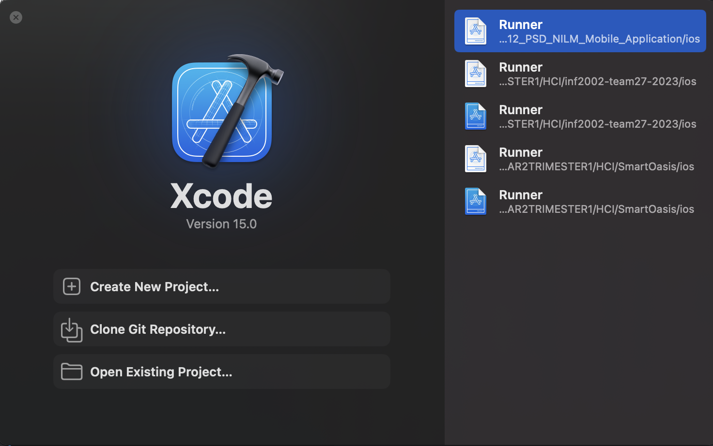

# NILM Smart Home Mobile Application Documentation

## About the project
Smart Home NILM is a mobile application development project that utilises the FIBARO API to provide homeowners with convenient access to the smart devices in their homes. Created using flutter to be used on cross platforms(Android and iOS), our primary feature is the ability to monitor household electrical consumption, offering insights into the usage patterns of individual devices. By integrating a specialised device into the circuit breaker, our application can analyse and identify the energy consumption of each device. This information allows us to calculate both the overall household cost and the running expenses associated with specific appliances. Armed with this data, homeowners can adjust their electrical usage habits and optimise their resource utilisation.

---
## Table of Contents
- [About the project](#about-the-project)
- [Table of Contents](#table-of-contents)
- [Installation Instructions](#installation)
  - [Prerequisites](#prerequisites)
  - [Environment requirements](#environment-requirements)
  - [Flutter Installation](#flutter-installation)
  - [Visual Studio Code Installation (Not for macOS)](#visual-studio-code-installation-not-for-macos)
  - [Android Studio and Emulator Setup](#android-studio-and-emulator-setup)
  - [iOS xCode simulator setup](#ios-xcode-simulator-setup)
  - [Running Smart Home NILM](#running-smart-home-nilm)
  - [Additional Resources](#additional-resources)
- [Usage](#usage)
  - [Features](#features)
- [License](#license)
- [Acknowledgements](#acknowledgements)
- [Troubleshooting](#troubleshooting)
  - [Common Issues](#common-issues-that-arise)
  - [Additional Resources](#additional-resources)
- [Contact Information](#contact-information)
- [Version History](#version-history)

## Installation Instructions

### Prerequisites
Ensure you have the following requirements before proceeding:  
- Wifi connection.
- A system running Windows or macOS
- Sufficient hardware specs (at least 8GB RAM and 10GB of free disk space).

### Environment requirements
Below are the requirements needed for building and running the mobile application
- Visual Studio Code
- Flutter SDK
- Visual Studio Code Flutter Dart plugins extension
- Android Studio
- Android Emulator
- xCode (macOS only)
- Cocoapods (macOS only)
- Ruby (macOS only)
- Brew (Not a hard requirement)
- iOS runtime environment (macOS only)

### Flutter Installation
#### 1. Download the Flutter SDK
  - Proceed to the [Flutter download page](https://docs.flutter.dev/get-started/install) to install Flutter on your system.
- Select your operating system (Windows/macOS).
- Download the latest stable release of the Flutter SDK.

#### 2. Extract the Flutter SDK
  - Extract the zip file to a desired location on your file system (e.g., `C:\src\flutter` on Windows, `$HOME/flutter` on Linux/macOS).
#### 3. Add Flutter to Your Path
  ##### Windows
- Search for 'env' in the start menu and select 'Edit the system environment variables'.
- Click on 'Environment Variables'.
- Under 'System Variables', select 'New' and add the path to the Flutter bin directory (e.g., `C:\src\flutter\bin`).
#### macOS/Linux
- Check the current shell that you are using by doing "echo $SHELL"
- export the absolute path of the flutter sdk up to the bin directory to your current shell type: zsh/bash/etc
###### Example given using bash shell
- `nano ~/.bash_profile` and inserting ` export PATH="$PATH:/Users/YourName/Desktop/flutter/bin" ` to the bottom of the profile and save
#### 4. Check that Flutter is installed
- Open a new terminal windows and run: `flutter --version`
- This command will show the current version of flutter installed on the system.
- If you encounter any issues, check that the system environment is updated accordingly with the correct path to the Flutter SDK.
  

#### 5. Run Flutter Doctor
- In a terminal run: `flutter doctor`
- This command will check your environment and display a report in the terminal.
- The report will show the required components needed for development on certain platforms.

### Visual Studio Code Installation (Not for macOS)
#### 1. Download and Install VS Code
  - Download VS Code from the [official website](https://code.visualstudio.com/).
- Run and follow the install wizard to install VS Code.

  

#### 2. Install the Flutter and Dart Plugins

  

- Open VS Code.

- Go to the Extensions view with `Ctrl + Shift + x` OR by clicking on the Extensions icon in the Activity Bar on the side of the window.

- Search for 'Flutter' and select the Flutter plugin created by Dart Code.

- Click 'Install' to install the extension.

  

### Android Studio and Emulator Setup

#### 1. Download and Install Android Studio

- Download Android Studio from the [official website](https://developer.android.com/studio).

- Run and follow the install wizard to install Android Studio.

#### 2. Install Android SDK components

- Open Android Studio.

- Upon opening, follow the Android Studio setup wizard to install the initial Android SDK components.

- After finishing installation, head over to Android Studio settings.

- Navigate to systems settings, and click 'SDK tools'.

- Check that Android SDK Command-line Tools is installed, otherwise tick the box and install accordingly.

  
#### 3. Create an Android Emulator
  
- Open Android Studio.

- Go to Virtual Device Manager.

- Click 'Create Device'.

- Choose a device definition and click 'Next'.

- Select a system image (recommend using one with Google Play services) and click 'Next'.

- Configure the emulator settings and click 'Finish'.

### iOS xCode simulator setup

#### 1. Installing xCode

WARNING:

- xCode is very macOS sensitive, and usually requires the most up-to-date versions to work with, as of 6 Nov 2023: `macOS sonoma 14`

- xCode can be installed via the app store 

- Installing xCode will make xCode the default text editor file

- You can always uninstall xCode after

- Right click on the text file type (e.g. .py) -> Get Info -> Open with: -> Select default text editor for THIS file type and press `Change All`

#### 2. Brew install

- Follow the steps for [installing brew](https://docs.brew.sh/Installation) (Skip this step if you already have brew installed)

#### 3. Upgrading Ruby and Cocoapods

- If you used brew install for ruby, brew install ruby to upgrade it, otherwise follow the steps below

- Gem update --system 3.4.2 (or any other version above this currently available, skip if you have a higher version)

- Check ruby version by running `ruby -v` in your terminal

- Install Cocoapods by running `gem install cocoapods`

#### 4. xCode installation and iOS simulator runtime installation

- Open up xCode and select clone the repository and enter the details as specified

- Follow the steps for [Installing an iOS runtime environment](https://developer.apple.com/documentation/xcode/installing-additional-simulator-runtimes) (e.g.: iOS 17)

- Add any kind of device that you want to your device list (e.g: iphone 15 pro, iphone 15) Under `Mange Run Destinations`

- Add a new simulator by clicking the `+` icon at the bottom left

- Check that you can boot up a simulator by running `open -a Simulator` in a terminal, the simulator should appear on the dock of your Mac

- Select the device of choice that you downloaded if you have not by right clicking on the application and hovering over device -> choice of simulator

### Running Smart Home NILM
#### 1. Check environment to ensure proper installation of components
- Open a terminal and run:

`flutter doctor`

- Check that the following are installed in the report:

1. Flutter

2. Android toolchain

3. Android Studio

  #### 2. Accept android license (For Windows)

- Open a terminal and run: `flutter doctor --android-licenses`
- Accept the license in order to proceed with build and development.

#### 3. Resolve dependencies

- Open a terminal, change to the project directory for Smart Home NILM and run:
`flutter clean` and THEN `flutter pub get`

- This command will check for required dependencies need to build the application and install them.

  

### Additional steps for macOS only

- `cd ios`

- `pod install`

- This step ensures that xCode will be able to recognize the project for an iOS build, else the project would not be able to properly build

#### 4. Running the application

##### For Windows

1. Open VS Code.

2. Select your emulator or device.

3. Press `F5` or click on 'Run > Start Debugging' in the main dart file to build and run your app.
  
##### For macOS

1. Open the Runner file in the `ios folder` in xCode

2. Select a simulator if you have yet to do so

3. Click the Run button to start building the project

---

## Usage

### Features
The list of features are as shown below
1. Viewing of device status (On/Off, battery level, brightness level, etc.)
2. Control of device
3. Creation of scenes
4. Separation of rooms
5. Tracking of household electrical consumption
6. Running cost of electrical consumption in the house
7. Adding family member controls

### Core Understanding of Code
1. Explain how to use the software or library. Include code examples, if applicable.
Provide information on configuration or settings (TODO)

---

## Troubleshooting

### Common Issues that arise:

1. Flutter project contains many errors and unable to build

This occurs when you have downloaded/pulled the project from a repository and your local environment has yet to download the required flutter pub dependencies for this project. A similar comparison would be the dependency handler; gradle, where dependencies are required to be downloaded for the project to run successfully.

2. TODO continue

If you encounter any issues, consult the following resources:

- [Flutter Installation Troubleshooting](https://flutter.dev/docs/get-started/install)

- [Android Emulator Troubleshooting](https://developer.android.com/studio/run/emulator#troubleshoot)

- [VS Code Troubleshooting](https://code.visualstudio.com/docs/supporting/troubleshoot)

## Additional Resources

- [Flutter Documentation](https://flutter.dev/docs)

- [Dart Documentation](https://dart.dev/guides)

- [VS Code Documentation](https://code.visualstudio.com/docs)

- [Android Studio Documentation](https://developer.android.com/studio/intro)

  
---
## Contact Information
If you have any questions, feedback, or encounter any issues, please don't hesitate to reach out to us. You can contact our team at homeationtest@gmail.com. We're committed to providing timely assistance and addressing any concerns you may have.
